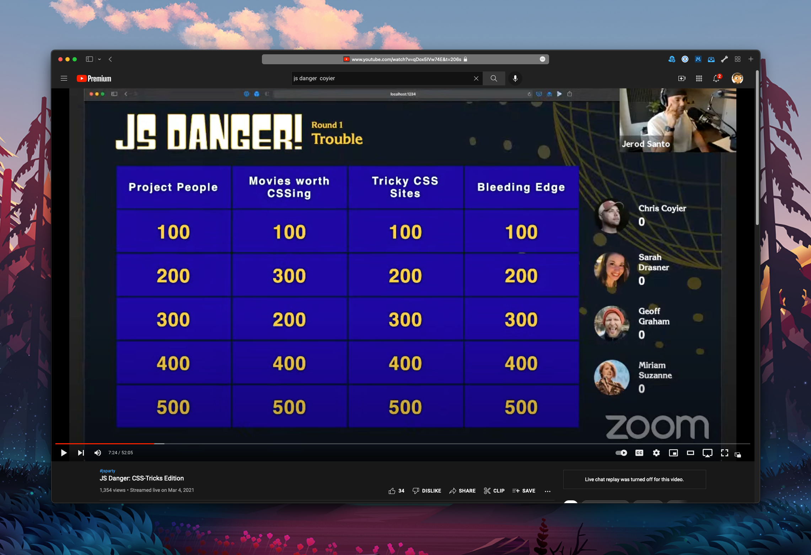
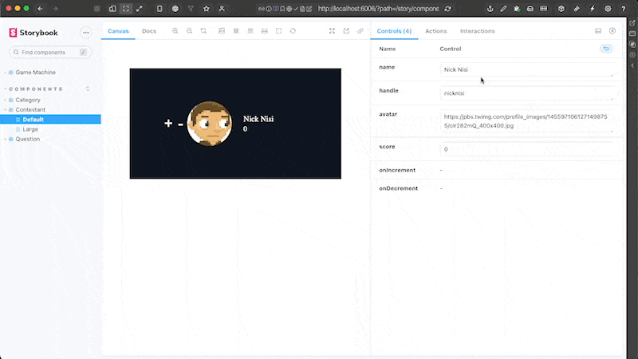
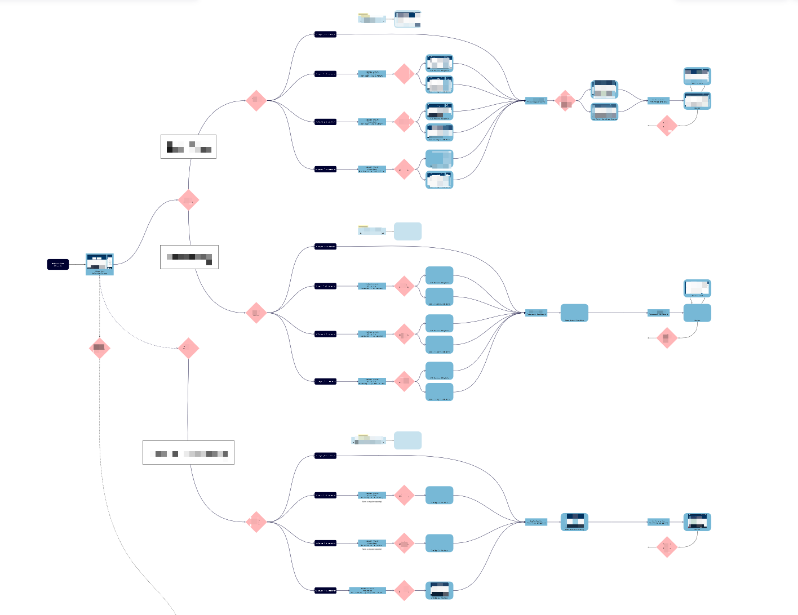

# [fit] Componentizing
# [fit] Application
# [fit] State

---


# A little about me

## [fit] Nick Nisi

- Staff Engineer at C2FO
- Organizer and Emcee of NEJS Conf (2015-2019) and NebraskaJS
- Emcee of TypeScript Conf US
- Panelist on JS Party

> I like JavaScript and TypeScript a lot.
> React is cool, too.

---

# [fit] Your application state is
# [fit] too complex

---

# [fit] #TMTOWTDI

## [fit] *There's more than one way to do it*

---

# [fit] The Quiz Show


##### JS Danger: CSS Tricks Edition - https://youtu.be/qDox5IVw74E

[.column]


[.column]

 Originally built with Dojo and Dojo Stores for application state
 Let's convert it to React!

The original used Dojo stores for application state management.
🤔 What should we use with React?

---

# The Context Way

```ts
export interface State {
  style: 'jsDanger' | 'goTime';
  players: Player[];
  rounds: Round[];
  currentQuestion: Question;
}

export const GameContext = createContext<null | State>(null);

export const GameProvider = ({ initialState, children }: GameProviderProps) => (
  <GameContext.Provider value={initialState}>{children}</GameContext.Provider>
);
```

> It's a good idea, but it lacks any real structure for dealing with the state object.

---

# Redux

```ts
function gameReducer(state = { gameStyle: 'jsParty' }, action) {
  switch (action.type) {
    case 'game/setStyle':
      return { gameStyle: action.payload }
    // ...
    default:
      return state
  }
}

const store = createStore(counterReducer);
store.dispatch({ type: 'game/setStyle', payload: 'goTime' });
```

---

# Some drawbacks of something like Redux

- While there's more structure, there's still a lot of ways to hurt yourself
    - infinite states
    - impossible states
- Can be difficult to visualize what's going on, as a whole
    - Especially as the app gets bigger

> there are tools and frameworks to work within to make this easier

---

# XState

[.column]

```ts
export const gameMachine = createMachine<GameMachineContext, GameMachineEvent>(
  {
    states: {
      game: {
        states: {
          question: {
            on: {
              TOGGLE_CONTESTANTS: 'contestants',
              SHOW_ANSWER: {
                target: 'answer',
                actions: assign({
                  currentQuestion: (_context) => undefined,
                }),
              },
            },
          },
          answer: { /* ... */ },
        },
      },
    },
  },
);
```

[.column]

- Finite states
- Infinite states handled as private context (such as number of questions in a game)
- Side-effects are declarative and explicit

---

# [fit] Other Benefits of XState

- Framework agnostic
    - Take it with you anywhere
    - Declarative configuration is easy to follow along
- Define transitions that work in specific states only
- State machines can invoke and send messages to other state machines
    - Break up your application logic how it makes sense for you

---

[.column]

```ts
const lightMachine = createMachine({
  // Machine identifier
  id: 'light',

  // Initial state
  initial: 'green',

  // Local context for entire machine
  context: {
    elapsed: 0,
    direction: 'east'
  },

  // State definitions
  states: {
    green: {
      /* ... */
    },
    yellow: {
      /* ... */
    },
    red: {
      /* ... */
    }
  }
});
```

[.column]

- The finite states that a machine can be in are defined as `states`.
- Any *infinite* states / context you need to control is defined as a `context` object 

---

# Now let's talk about
# [fit] React components

React makes it really easy to create declarative UIs easily

[.column]

```ts
export const Game = () => {
  return (
    <div className="game">
      <Player name="nick" />
      {/* ... */}
    </div>
  )
}
```

[.column]

```ts
export const Player = ({ name }: PlayerProps) => (
  <div>
    
    <div className="name">{name}</div>
  </div>
)
```

---

# [fit] Developing UIs

- Working with declarative UI is fast and fun
    - Define inputs (props) and outputs (the rendered markup)
- Build a harness page to test the components by themselves without needing to spin up the entire app

---

# [fit] Storybook

Storybook is a tool to build components faster

- Build components outside of your app, in isolation
- Control the data passed to the components and how they're rendered
- Streamline UI development and testing

---



---

# [fit] What if we could do this
# [fit] with our
# [fit] application state?

---

# [fit] An app flow example



---

# [fit] Componentizing Application State

- Treat the app state as just another component
- Work on the state of the application and verify its flow **BEFORE** the UI components exist
- Walk through the flow with non-technical stakeholders

---

# XState can do all of this

- Render state charts directly from the actual application flow
- Walk through the state and verify all possible routes from one state to another
- Walk through entire application flow before the UI exists
- Do all of this in Storybook

<br>

```bash
npm install storybook-xstate-addon
```

---

# [fit] Let's look at
# [fit] some code

---

# [fit] Wrapping Up

- https://xstate.js.org
- https://github.com/nicknisi/quiz-show
- https://storybook.js.org/addons/storybook-xstate-addon
<br>

> Treating your application state like a component is easy and fun with XState and Storybook!

---

# [fit] THANKS


